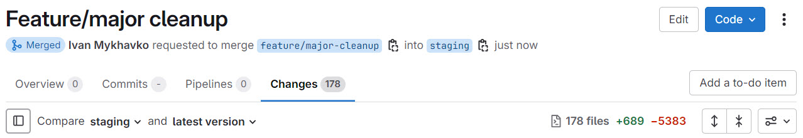

## Introduction

Over time, as a Laravel project evolves - whether through updates, refactoring, or version upgrades - unused classes can accumulate in the codebase. 
These unused classes add unnecessary maintenance overhead, increasing complexity and making upgrades more difficult.

To solve this issue, we can use the `tomasvotruba/class-leak` package, which helps detect and remove unused classes from our Laravel apps.

## Why Remove Unused Classes?

Maintaining unused classes in a project leads to:
- Increased technical debt
- More time spent on unnecessary maintenance
- Higher complexity in upgrades and refactoring
- Wasted effort on testing and dependency management

By detecting and removing unused classes, we streamline our codebase, making it more efficient and maintainable.

## Installing `class-leak`

To get started, install the package as a development dependency:

```bash
composer require tomasvotruba/class-leak --dev
```

The package supports PHP 7.2+.

## Running the Unused Class Detection

When installed, run the following command to check for unused classes in key directories of your Laravel application:

```bash
php vendor/bin/class-leak check app tests config routes bootstrap database
```

### Example Output

```plaintext
1. Finding used classes
=======================
 760/760 [▓▓▓▓▓▓▓▓▓▓▓▓▓▓▓▓▓▓▓▓▓▓▓▓▓▓▓▓] 100%

2. Extracting existing files with classes
=========================================
 760/760 [▓▓▓▓▓▓▓▓▓▓▓▓▓▓▓▓▓▓▓▓▓▓▓▓▓▓▓▓] 100%

Classes with a parent/interface:
--------------------------------
app/DataTransferObjects/Cart/CartStatusDTO.php
app/DataTransferObjects/Order/OrderCreateDTO.php
...

Classes without any parent/interface - easier to remove:
--------------------------------------------------------
app/Http/Middleware/Frontend/EnsureUserHasApiAccess.php
app/Support/Helpers/ArrayHelper.php
...

[ERROR] Found 30 unused classes. Remove them or skip them using "--skip-type" option
```

After reviewing and removing unused classes, the tool will display:

```plaintext
[OK] All services are used. Great job!
```

## How `class-leak` Works

The tool follows a simple process:
1. **Identify all existing classes** in directories like `app`, `src`, etc.
2. **Find all class usages** across method calls, property accesses, and constant fetches.
3. **Compare the lists** and determine which classes are never used.

This helps locate and remove unnecessary code that is never referenced in the project.

## Handling Special Cases

### Skipping Specific Classes

In some cases, you may want to exclude certain classes from the scan. Use the `--skip-type` option:

```bash
php vendor/bin/class-leak check app src --skip-type="App\Contracts\SomeInterface"
```

### Detecting Test-Only Classes

A class that is used only in tests may still be considered unused in production. If a class is only referenced in tests, consider removing it along with its corresponding test cases.

## Automating in CI/CD

To prevent unused classes from creeping back into the project, add `class-leak` as part of your CI pipeline. This ensures that any new unused classes introduced during development are detected early and removed.

## Result

Here is example pull request after reviewing and running `class-leak`.


## Conclusion

Detecting and removing unused classes is a simple yet effective way to keep a Laravel project clean and maintainable. By integrating `class-leak` into your workflow, you can:
- Reduce maintenance overhead
- Improve code clarity
- Avoid testing and upgrading unnecessary code

Try running it on your Laravel project today and free your codebase from unused classes!

